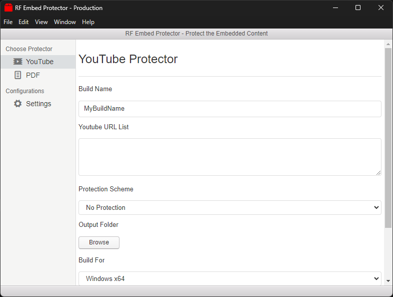

# rf_embed_protector - Video Embed and PDF Embed Protection

[README dengan Bahasa Indonesia Klik di Sini](https://github.com/rakifsul/rf_embed_protector/blob/main/README_id.md)

## Intro

This application is capable of packaging embedded videos or PDFs into an exe file.

Moreover, the exe file can also be password-protected.

This application may be useful for those who want to share unlisted videos without accidentally distributing their video links.

The application can create executables for both Windows and Linux operating systems.

However, it can only run on Windows, and has only been tested on Windows 11.

## Where to Download

Download the executables on "Releases" page.

## How to Use

You can find the executable binaries in "dist" folder.

Once found, run the .exe file.

## Screenshot

	

