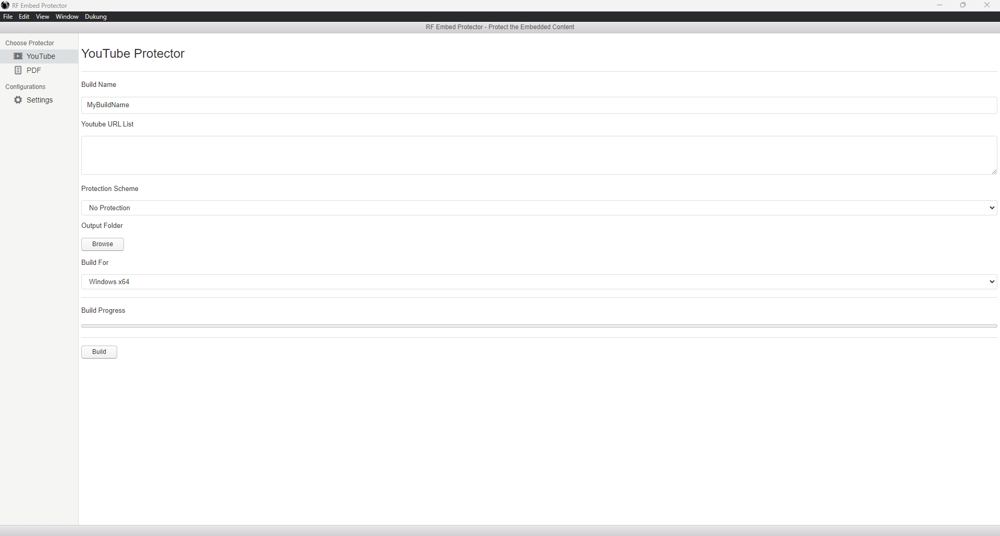

# rf_embed_protector - Proteksi Video Embed dan PDF Embed

## Pendahuluan

Aplikasi ini adalah aplikasi yang dapat mempaket video embed atau pdf embed ke dalam file exe.

Tidak hanya itu, exe tadi juga bisa diberi password.

Aplikasi ini mungkin berguna bagi Anda yang ingin membagikan video unlisted tanpa perlu menyebarkan link video-nya tanpa disengaja.

Aplikasi ini dapat membuat executable untuk OS Windows dan Linux.

Hanya saja, aplikasi ini hanya dapat dijalankan di Windows, dan hanya telah teruji di Windows 11.

## Download di Mana

Download executable dari aplikasi ini di halaman "Releases".

## Cara Penggunaan

Untuk menjalankan aplikasi ini, buka folder "dist".

Di sana ada file binary-nya.

## Screenshot

	

## Link untuk Traktir

- https://karyakarsa.com/rakifsul/info